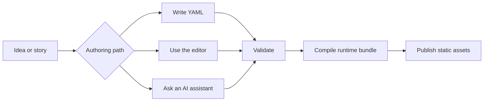
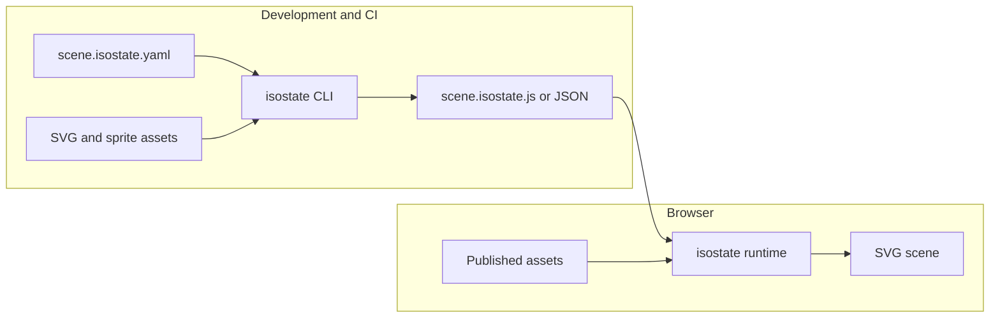

# isostate Docs

isostate turns YAML into compiled, browser-safe isometric SVG scenes. You can
write the YAML by hand, edit it visually, or ask an AI assistant to draft it.
The browser still receives the same small runtime bundle.

## The Flow

1. Decide what the scene should explain.
2. Choose an authoring path: hand-written YAML, the website editor, or AI with
   the authoring skill installed.
3. Add assets, labels, connections, animation, and camera stops.
4. Validate and compile the YAML during development or CI.
5. Publish only the compiled bundle, runtime, and referenced assets.

## Start Here

| Goal | Read |
|---|---|
| Build the first scene | [Getting Started](./getting-started.md) |
| Understand scene timelines | [Author Scene Deltas](./guides/author-scene-deltas.md) |
| Create SVG or sprite assets | [Assets Workflow](./guides/assets-workflow.md) |
| Add movement, flows, and camera focus | [Animation And Connections](./guides/animation-and-connections.md) |
| Use the visual editor | [Use The Editor In Astro](./guides/use-editor-in-astro.md) |
| Validate, compile, bundle, inspect | [Use The CLI](./guides/use-the-cli.md) |
| Publish static output | [Deploy Static Bundle](./guides/deploy-static-bundle.md) |
| Let an AI assistant help | [Install The Authoring Skill](./guides/install-authoring-skill.md) |

## Runtime Boundary

The YAML parser, validator, compiler, CLI, editor, and `yaml` package are
development tools. They do not ship in the normal browser runtime path.

## References

- [Public API](./reference/public-api.md): runtime, DSL, CLI, and support
  entrypoints.
- [Editor Reference](./reference/editor.md): editor embedding API. The editor
  is its own package internally, but it is not planned as a public npm package
  for this version.
- [Runtime Bundle](./reference/runtime-bundle.md): compiled artifact shape.
- [Types Reference](./reference/types.md): exported TypeScript contracts.
- [Errors](./reference/errors.md): structured error classes and fixes.

## Examples

Use [Examples](./examples/README.md) for focused copyable workflows: runtime
mounting, scroll control, custom assets, static bundling, editor embedding,
bundle inspection, and theme customization.
