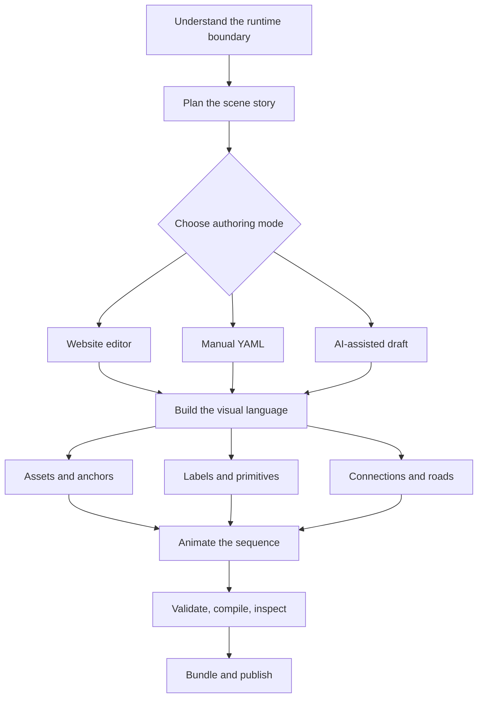
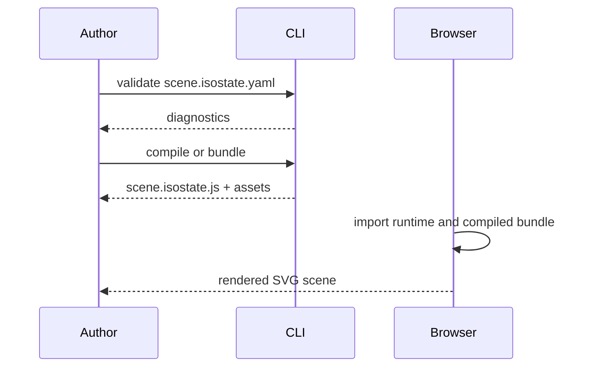

# isostate Documentation

isostate is a workflow for turning a technical story into a compiled
isometric SVG scene. The source is YAML. The browser receives a small runtime,
a compiled scene bundle, and referenced assets.

The docs are organized around the same path you follow when creating a scene:
understand the boundary, plan the story, choose an authoring mode, build the
visual language, animate it, verify it, and publish it.

## Read In This Order

### 1. Understand

Start with [How isostate works](./concepts/how-isostate-works.md). It explains
the development/runtime split, why YAML is compiled before the browser sees it,
and which files are source versus output.

Then run [Getting Started](./getting-started.md) to build and mount the first
scene.

### 2. Create

Use [Plan A Scene](./guides/plan-a-scene.md) before writing YAML. It gives you a
simple storyboard format: each scene stop gets one purpose, one visual change,
and one verification check.

Choose one authoring path:

| Path | Best For | Page |
|---|---|---|
| Website editor | Placing assets, checking anchors, iterating visually | [Use The Editor](./guides/use-editor-in-astro.md) |
| Manual YAML | Source-controlled diagrams and precise review | [Author Scene Deltas](./guides/author-scene-deltas.md) |
| AI assistant | Drafting or reviewing YAML from a written brief | [Install Authoring Skill](./guides/install-authoring-skill.md) |

### 3. Build The Visual Language

Use [Assets Workflow](./guides/assets-workflow.md) to create SVG assets, sprite
sheets, manifests, anchors, and AI-generated asset sets. Use
[Animation And Connections](./guides/animation-and-connections.md) for motion,
connection routes, road paths, flow effects, and camera focus.

### 4. Verify And Publish

Use [Convert Mermaid Diagrams](./guides/convert-mermaid.md) to turn an
existing flowchart into a starting scene.

Use [The CLI](./guides/use-the-cli.md) for repeatable validation, compilation,
inspection, and CI. Use [Deploy Static Bundle](./guides/deploy-static-bundle.md)
when the result should be copied into a website public folder or CDN.

## Examples

Use [Examples](./examples/README.md) after the main workflow is clear. They are
copyable slices for runtime mounting, scroll control, custom assets, pointer
interactivity, snapshot export, static bundling, editor embedding, bundle
inspection, and theme customization.

## Reference

The reference pages are for details after you know the flow:

- [Public API](./reference/public-api.md)
- [Editor Reference](./reference/editor.md)
- [Runtime Bundle](./reference/runtime-bundle.md)
- [Types](./reference/types.md)
- [Errors](./reference/errors.md)
