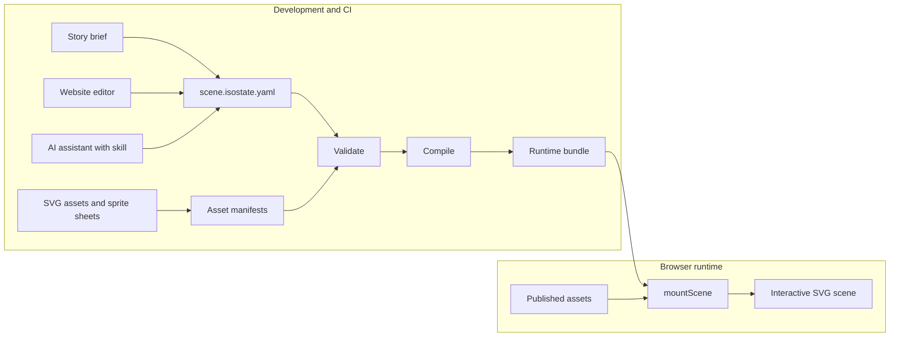
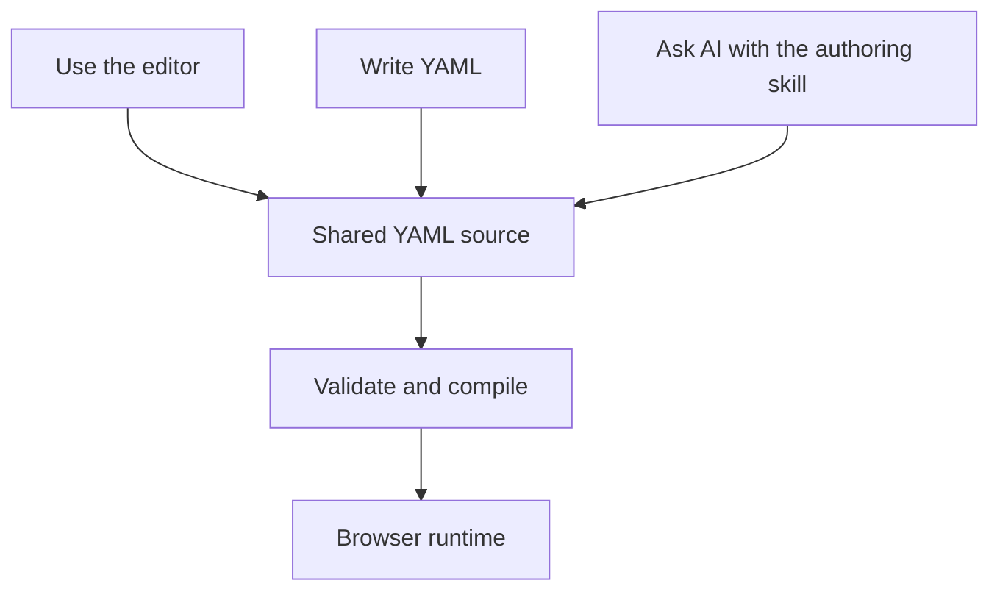

# How isostate Works

isostate separates authoring from runtime. YAML, validation, compilation, asset
catalogs, and the editor are development tools. The browser runtime only mounts
a compiled bundle and loads browser-safe assets.

## Source And Output

| File | Role | Edited By |
|---|---|---|
| `.isostate.yaml` | Source scene document | Human, editor, or AI assistant |
| SVG/PNG/WebP assets | Source visual assets | Designer, generator, or catalog maintainer |
| `*.manifest.json` | Editor catalog metadata | CLI or tooling |
| `scene.isostate.js` / `.json` | Compiled runtime bundle | CLI/compiler |
| `isostate.runtime.js` | Standalone browser runtime for static bundles | CLI bundle command |
| `manifest.json` in static output | Deployment metadata and digests | CLI bundle command |

Do not edit generated static output by hand. Change the YAML or source assets,
then validate and regenerate.

## The Three Authoring Modes

All authoring modes produce the same YAML:

Use the editor when placement and anchors matter. Write YAML when the structure
is already clear. Use AI when you have a written story brief and want a draft or
review pass.

## Runtime Boundary

The browser runtime does not include:

- YAML parsing
- DSL validation
- compilation
- CLI code
- editor code
- asset manifest scanning
- the `yaml` package

That boundary keeps production pages small and makes validation a build-time
responsibility.

Next: [Plan A Scene](../guides/plan-a-scene.md).
