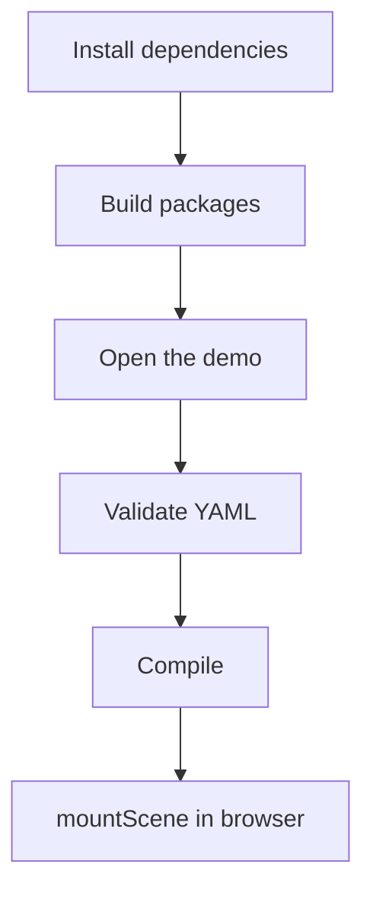

# Getting Started

This page gets one scene mounted in a browser. It is intentionally small; the
full creation workflow starts in [Plan A Scene](./guides/plan-a-scene.md).

You will run the demo, compile YAML, and mount the compiled bundle.



If you want an AI assistant to help author scenes, install the project skill
first:

```bash
bunx skills add sebastianwessel/isostate --skill authoring-isostate-scenes
```

See [Install The Authoring Skill](./guides/install-authoring-skill.md) for
agent-specific setup and verification.

## 1. Run The Demo

From the repository root:

```bash
bun install
bun run build
python3 -m http.server 4173
```

Open:

```text
http://localhost:4173/examples/basic/
```

The browser loads `examples/basic/scene.isostate.js`. It does not parse YAML.
That compiled file is generated from `examples/basic/source.isostate.yaml`.

## 2. Validate And Compile

Use the CLI when you want repeatable validation and generated browser assets:

```bash
bunx --package @sebastianwessel/isostate-cli isostate validate scene.isostate.yaml
bunx --package @sebastianwessel/isostate-cli isostate compile scene.isostate.yaml --out public/scene.isostate.js
```

See [Use The CLI](./guides/use-the-cli.md) for all commands, including
`bundle` and `inspect`.

## 3. Mount The Runtime

```ts
import { mountScene, type RuntimeBundle } from '@sebastianwessel/isostate';
import sceneBundle from './scene.isostate.js';

const target = document.querySelector<HTMLElement>('#scene');
if (!target) throw new Error('Missing #scene');

const mounted = mountScene(target, sceneBundle as RuntimeBundle, {
	label: 'Infrastructure scene',
	controller: false
});

mounted.engine.setProgress(0.5);
```

## 4. Compile In A Script

```ts
import {
	compileScene,
	parseScene,
	toJs,
	validateScene
} from '@sebastianwessel/isostate/dsl';

const document = parseScene(yamlText);
const report = validateScene(document);
if (!report.isValid) throw new Error(report.errors[0]?.message);

const bundle = compileScene(document);
const moduleText = toJs(bundle);
```

Do not import `@sebastianwessel/isostate/dsl` from browser code. It is
development tooling.

## 5. Read The YAML Shape

YAML starts with a `header`, then defines ordered `scenes`.

```yaml
header:
  assetBaseUrl: ./assets
  assets:
    - id: service-box
      path: service-box
  floor:
    layer: structures
  layers:
    - name: structures

scenes:
  - id: initial
    elements:
      - id: api
        asset: service-box
        layer: structures
        at: [1, 1]
      - id: api-label
        asset: text
        layer: structures
        at: [1, 1]
        text:
          value: "Service\nAPI"

  - id: scaled
    update:
      elements:
        - id: api
          at: [2, 1]
          size: 2
```

The first scene is the full placement snapshot. Later scenes define only deltas.
`asset: text` is built in and is not declared in `header.assets`.

Next, follow the full authoring path:

- [Plan A Scene](./guides/plan-a-scene.md)
- [Author Scene Deltas](./guides/author-scene-deltas.md)
- [Assets Workflow](./guides/assets-workflow.md)
- [Animation And Connections](./guides/animation-and-connections.md)
- [Deploy Static Bundle](./guides/deploy-static-bundle.md)
