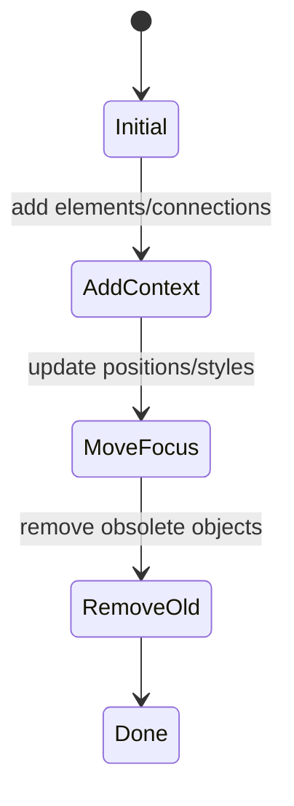

# Animation And Connections

isostate animation is scene-based. You do not write keyframes. You write a
sequence of resolved scene stops, and the runtime interpolates between them.

Use this guide after [Assets Workflow](./assets-workflow.md), when the visual
objects exist and the scene needs movement, relationships, or camera focus.

## Scene Timeline

The first scene is a complete placement snapshot. Later scenes contain sparse
deltas.



```yaml
scenes:
  - id: initial
    elements:
      - id: api
        asset: api-server
        at: [2, 2]

  - id: database-enters
    add:
      elements:
        - id: db
          asset: database
          at: [5, 2]
          enter: fade-in-grow

  - id: api-scales
    update:
      elements:
        - id: api
          size: 2
```

Omitted objects persist unchanged. Omitted nested text, primitive, and
connection style fields also persist unchanged.

## Element Motion

Move an element by updating `at`. Scale by updating `size`. Use whole grid-cell
coordinates for authored YAML.

```yaml
- id: car-center
  update:
    elements:
      - id: car
        at: [7, 4]
        ambient:
          - name: pulse
```

`size: 0` is allowed only for updates, so an existing object can shrink down
without being removed. New placements still need a positive whole-cell size.

## Entry And Exit

Added objects default to `enter: fade-in`; removed objects default to
`exit: fade-out`. Use explicit lifecycle names when the entrance carries
meaning:

```yaml
add:
  elements:
    - id: service
      asset: api-server
      at: [2, 2]
      enter: slide-in-left
remove:
  elements:
    - id: old-service
      exit: fade-out-shrink
```

When readers scrub backward, the runtime plays the opposite transition.

## Connections

Use connections for relationships, arrows, roads, routes, and data flow. They
are generated SVG paths, not external assets.

```yaml
connections:
  - id: api-to-db
    from:
      element: api
      side: auto
    to:
      element: db
      side: auto
    routing:
      mode: orthogonal
      avoid: objects
      clearance: 1
    style:
      pattern: dotted
      stroke: var(--iso-flow)
      strokeWidth: 3
    start: dot
    end: arrow
    ambient:
      - name: flow
```

Use manual `route` points for roads or deliberate visual paths:

```yaml
connections:
  - id: main-road
    route: [[1, 5], [7, 5], [7, 3]]
    style:
      variant: road
      lane: center-dashed
    start: none
    end: none
```

Remove connections explicitly when removing an endpoint element. The runtime
does not auto-delete them, because authored scene deltas should be reviewable.

## Camera Focus

Use camera metadata when the story should zoom to a part of the scene.

```yaml
- id: focus-api
  camera:
    target:
      element: api
      padding: 48
    duration: 400
```

Scene stops without camera metadata inherit the previous camera. Use
`target.reset: true` to return to the compiled full-scene view.

At runtime, hosts can also focus the camera through the controller:

```ts
mounted.controller?.zoomToElement('api', { padding: 48 });
mounted.controller?.zoomToArea({ at: [1, 1], size: [4, 3] });
mounted.controller?.resetZoom();
```

## Scroll And Step Control

Use scroll control for long-form docs and manual control for presentations.

```ts
const mounted = mountScene(target, bundle, {
  controller: {
    enabled: true,
    mode: 'scroll',
    container: document.documentElement
  }
});
```

Manual mode lets your app drive progress:

```ts
mounted.controller?.setProgress(0.5);
mounted.controller?.next();
mounted.controller?.previous();
```

## Review Checklist

- Each later scene only changes what is different from the previous scene.
- Element ids and connection ids remain stable across updates.
- Connections use `from`/`to` for object relationships and `route` for visual
  paths.
- Long arrows are authored as connections, not stretched SVG assets.
- Removed endpoint elements have matching connection removals.
- Camera stops are sparse and intentional.
- Validation passes before compile or bundle.

Next: [Use The CLI](./use-the-cli.md).
