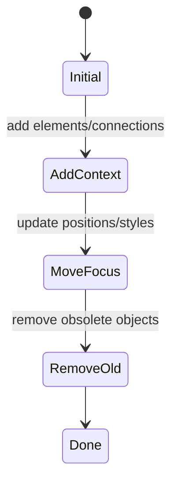

# Animation And Connections

isostate animation is scene-based. You do not write keyframes. You write a
sequence of resolved scene stops, and the runtime interpolates between them.

Use this guide after [Assets Workflow](./assets-workflow.md), when the visual
objects exist and the scene needs movement, relationships, or camera focus.

## Scene Timeline

The first scene is a complete placement snapshot. Later scenes contain sparse
deltas.


```mermaid
stateDiagram-v2
  [*] --> Initial
  Initial --> AddContext: add elements/connections
  AddContext --> MoveFocus: update positions/styles
  MoveFocus --> RemoveOld: remove obsolete objects
  RemoveOld --> Done
```

```yaml
scenes:
  - id: initial
    elements:
      - id: api
        asset: api-server
        at: [2, 2]

  - id: database-enters
    add:
      elements:
        - id: db
          asset: database
          at: [5, 2]
          enter: fade-in-grow

  - id: api-scales
    update:
      elements:
        - id: api
          size: 2
```

Omitted objects persist unchanged. Omitted nested text, primitive, and
connection style fields also persist unchanged.

## Element Motion

Move an element by updating `at`. Scale by updating `size`. Use whole grid-cell
coordinates for authored YAML.

```yaml
- id: car-center
  update:
    elements:
      - id: car
        at: [7, 4]
        ambient:
          - name: pulse
```

`size: 0` is allowed only for updates, so an existing object can shrink down
without being removed. New placements still need a positive whole-cell size.

## Entry And Exit

Added objects default to `enter: fade-in`; removed objects default to
`exit: fade-out`. Use explicit lifecycle names when the entrance carries
meaning:

```yaml
add:
  elements:
    - id: service
      asset: api-server
      at: [2, 2]
      enter: slide-in-left
remove:
  elements:
    - id: old-service
      exit: fade-out-shrink
```

When readers scrub backward, the runtime plays the opposite transition.

## Connections

Use connections for relationships, arrows, roads, routes, and data flow. They
are generated SVG paths, not external assets.

```yaml
connections:
  - id: api-to-db
    from:
      element: api
      side: auto
    to:
      element: db
      side: auto
    routing:
      mode: orthogonal
      avoid: objects
      clearance: 1
    style:
      pattern: dotted
      stroke: var(--iso-flow)
      strokeWidth: 3
    start: dot
    end: arrow
    ambient:
      - name: flow
```

Use manual `route` points for roads or deliberate visual paths:

```yaml
connections:
  - id: main-road
    route: [[1, 5], [7, 5], [7, 3]]
    style:
      variant: road
      lane: center-dashed
    start: none
    end: none
```

Remove connections explicitly when removing an endpoint element. The runtime
does not auto-delete them, because authored scene deltas should be reviewable.

## Camera Focus

Use camera metadata when the story should zoom to a part of the scene.

```yaml
- id: focus-api
  camera:
    target:
      element: api
    padding: 48
    duration: 400
```

Scene stops without camera metadata inherit the previous camera. Use
`target.reset: true` to return to the compiled full-scene view.

At runtime, hosts can also focus the camera through the controller:

```ts
mounted.controller?.zoomToElement('api', { padding: 48 });
mounted.controller?.zoomToArea({ at: [1, 1], size: [4, 3] });
mounted.controller?.resetZoom();
```

## Scroll And Step Control

Use scroll control for long-form docs and manual control for presentations.

```ts
const mounted = mountScene(target, bundle, {
  controller: {
    container: document.documentElement
  }
});
```

For presentation controls, mount with `controller: {}` and let your app drive
the timeline. Use scene navigation for animated travel and `setProgress` for
an exact slider or scroll position:

```ts
mounted.controller?.setProgress(0.5);
mounted.controller?.setSceneIndex(2);
mounted.controller?.nextScene();
mounted.controller?.prevScene();
```

Scene navigation interpolates over `transitionDuration` (default `600` ms)
using `transitionEasing` (default `ease-in-out`). Direct progress updates
interrupt navigation so a scrubber follows the pointer immediately. Use
`transitionDuration: 0` for immediate navigation, including reduced-motion
presentations. Pause and resume controls also freeze ongoing ambient motion.

Keep an element's id stable and update its `at` across stops to show it moving.
Replacing a scene with unrelated ids shows entry/exit effects but cannot show
one object traveling. The overview follows the same request through client,
API, storage, worker, AI review, and human approval; its scene buttons travel
between stops while scrolling continuously scrubs the story.

The overview's **Pause effects** control freezes ongoing messages, status, and
ambient effects while its reader-directed navigation and entry/exit effects
remain available.

## Review Checklist

- Each later scene only changes what is different from the previous scene.
- Element ids and connection ids remain stable across updates.
- Connections use `from`/`to` for object relationships and `route` for visual
  paths.
- Long arrows are authored as connections, not stretched SVG assets.
- Removed endpoint elements have matching connection removals.
- Camera stops are sparse and intentional.
- Validation passes before compile or bundle.

Next: [Use The CLI](./use-the-cli.md).

## Rounded Tracks And Moving Messages

Use `beam` for a dimensional track. Round its corners in projected SVG pixels
and add a restrained glow to mark the active route. Messages are generated SVG
glyphs that travel along the actual rounded track, including reverse routes.
They do not need an asset declaration.

```yaml
connections:
  - id: agent-to-reviewer
    from: { element: agent }
    to: { element: reviewer }
    style:
      variant: beam
      stroke: "#15997e"
      cornerRadius: 12
      glow: "#63d9ba"
      glowWidth: 8
    message:
      kind: envelope
      color: "#ecfff7"
      size: 10
      duration: 2200
      count: 1
```

Choose `packet` for a payload, `orb` for a signal, and `envelope` for a request
or human handoff. Size is `2..32` SVG pixels; duration is `200..30000`
milliseconds; count is an integer `1..4`. Defaults are `packet`, size `10`,
duration `1800`, count `1`, and enabled `true`. `cornerRadius` defaults to `0`
and must be non-negative; `glowWidth` defaults to `8` and must be positive.
Colors support safe CSS values, including semantic `var(--token)` colors.

A message object persists until changed. Turn completed work off explicitly:

```yaml
- id: review-received
  update:
    connections:
      - id: agent-to-reviewer
        message: { enabled: false }
    elements:
      - id: agent
        activity: { state: waiting, color: "#c68927" }
      - id: reviewer
        activity: { state: processing, color: "#15997e" }
```

Unlike nested text and primitive patches, each new `message` or `activity`
object replaces the whole previous object. Repeat any custom values you want
to retain. Omitting the object retains it unchanged.

## Show Work On An Element

Set `activity.state` to `processing`, `waiting`, `complete`, or `error` to add
a status indicator to a placed object. Use `idle` when work ends and no status
should remain. Processing adds motion; reduced-motion users see a static
indicator. Labels should explain the meaning as well as color.

An existing image or sprite can also change its visual while retaining its id
and connections. Declare both assets in the header, then update the asset:

```yaml
- id: approval-needed
  update:
    elements:
      - id: agent
        asset: agent-await-human
        activity: { state: waiting, color: "#c68927" }
```

Asset replacement works between declared images and logical sprites. It cannot
convert an element to or from generated text or primitives. Activity, messages,
and asset swaps change at the destination scene stop when navigating forward
or backward. The target asset uses its own crop and anchor.

`mounted.controller?.pause()` freezes message and processing animations;
`resume()` continues them. Reduced-motion preference keeps the glyphs visible
and static. Use a pause button for previews with ongoing motion.
