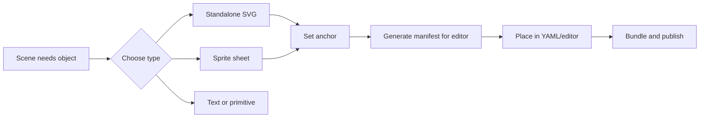
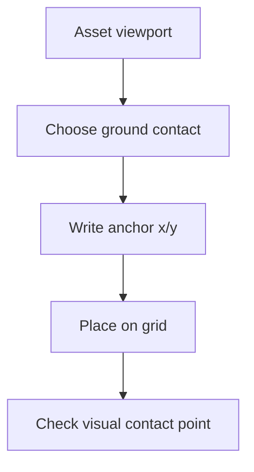

# Assets Workflow

Assets make an isostate scene readable. Keep them small, anchored, and
publishable before you build a long animation around them.

This guide belongs after [Plan A Scene](./plan-a-scene.md): first decide what
the story needs, then create only the assets that serve that story.



## Choose The Asset Type

| Need | Use | Notes |
|---|---|---|
| One object per file | Standalone SVG | Best for infrastructure, products, icons, buildings. |
| Many small objects from one image | Sprite sheet | Best for larger visual libraries or generated 3D raster sprites. |
| Text | `asset: text` | Built in; do not create an SVG for plain labels. |
| Ground area or marker | `rectangle`, `circle`, `polygon`, `line` | Built in; do not declare in `header.assets`. |
| Relationship, road, arrow, data flow | `connections` | Generated by the renderer; do not stretch arrow SVGs. |

## Standalone SVG Assets

Use one SVG per logical object. A one-cell asset should normally use a
`64 x 64` viewBox, tight artwork, and a checked anchor.

```yaml
header:
  assetBaseUrl: ./assets/aws-3d
  assets:
    - id: api-server
      path: api-server
      anchor: [0.5, 1]
```

`path` is combined with `assetBaseUrl`; `.svg` may be omitted for standalone SVG
assets. The browser loads the compiled URL with an SVG `<image>` element.

## Sprite Sheets

Use sprite sheets when many assets share one image file. Sprite sheets are also
the recommended path for generated PNG or WebP sprites.

```yaml
header:
  assetBaseUrl: ./assets/traffic
  assets:
    - id: traffic-sprites
      type: sprite-sheet
      path: traffic-sprites.png
      sheetSize: [1024, 1024]
      tileSize: [256, 256]
      anchor: [0.5, 0.85]
      sprites:
        red-car: [0, 0]
        blue-car:
          at: [1, 0]
          anchor: [0.5, 0.88]
        road-crossing:
          rect: [512, 256, 256, 256]
          anchor: [0.5, 0.5]
```

Elements reference the nested sprite id, not the sheet id:

```yaml
scenes:
  - id: initial
    elements:
      - id: car
        asset: red-car
        at: [2, 3]
```

Recommended sprite sizes:

| Use | Recommended source size |
|---|---|
| One-cell objects | `128 x 128` or `256 x 256` pixels per sprite |
| Detailed skeuomorphic objects | `256 x 256` pixels per sprite |
| Roads, zones, and floor decals | `256 x 256` pixels, transparent background |
| Full sheet | Up to `2048 x 2048` when practical; prefer WebP for large catalogs |

Use transparent PNG/WebP for raster sheets. A checkerboard visible in the scene
usually means the pixels are not transparent; it is not an isostate background.

## Generate Assets With OpenAI

For AI-generated assets, generate a consistent sheet instead of unrelated
single images. Prompt for:

- isometric three-quarter view
- transparent background
- consistent lighting direction
- same camera angle and scale
- no shadows outside the sprite cell unless every sprite uses them consistently
- one centered object per cell
- enough padding to avoid clipping, but not so much that anchors become hard to
  review

Example prompt:

```text
Create a transparent PNG sprite sheet of 16 isometric traffic assets in a
consistent skeuomorphic 3D style. Use a 4 by 4 grid, 256 px per tile. Include
red car, blue car, taxi, bus, delivery van, straight road, curved road,
intersection, crosswalk, traffic light, stop sign, yield sign, no-entry sign,
traffic cone, road barrier, and street lamp. Keep each object centered with
matching camera angle and lighting.
```

After generation, inspect the alpha channel, crop obvious empty padding, and
write the manifest or YAML with exact `sheetSize`, `tileSize`, and per-sprite
anchors.

## Anchor Points

`anchor: [x, y]` tells the renderer which point inside the normalized asset
viewport touches the element footprint.



Use `[0.5, 1]` for centered objects that stand on the bottom edge. Use
`[0.5, 0.85]` for cars or objects whose visible tires/base sit above the tile
bottom because of perspective. Use `[0.5, 0.5]` for flat road tiles that should
sit in the center of a grid cell.

Do not fix bad anchors with fractional `at` values. Correct the catalog anchor
so every placement of that asset behaves consistently.

## Asset Manifests For The Editor

The website editor loads asset manifests, one manifest per asset family. Keep
families separate so each catalog owns its base URL and digest.

```json
{
  "format": "isostate.asset-manifest",
  "version": "1",
  "assetBaseUrl": "./traffic",
  "assets": [
    {
      "id": "traffic-sprites",
      "type": "sprite-sheet",
      "path": "traffic-sprites.png",
      "sheetSize": [1024, 1024],
      "tileSize": [256, 256],
      "anchor": [0.5, 0.85],
      "sprites": {
        "red-car": { "at": [0, 0] }
      }
    }
  ]
}
```

Use the CLI manifest command for repeatable digests when possible:

```bash
npx --package @sebastianwessel/isostate-cli isostate assets manifest assets/traffic \
  --out public/assets/traffic.manifest.json \
  --asset-base-url ./traffic
```

## Publish Assets

Before publishing:

1. Run `isostate validate scene.isostate.yaml`.
2. Run `isostate bundle ... --asset-dir ... --public-asset-base ...`.
3. Inspect the generated `manifest.json`.
4. Open the page and verify assets load without broken image placeholders.
5. Check anchors by selecting a few objects near grid lines.

The static bundle should contain compiled scene data, the runtime, copied
referenced assets, and digests. It should not contain the editor, YAML parser,
validator, compiler, CLI, or authored YAML.

Next: [Animation And Connections](./animation-and-connections.md).
