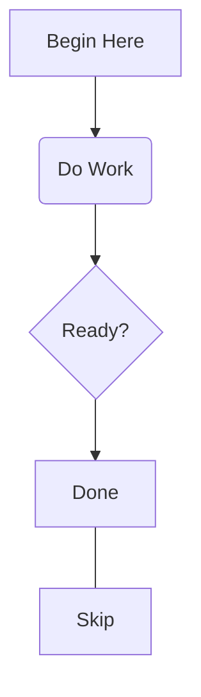

# Convert A Mermaid Flowchart

Use `isostate mermaid2dsl` when you already have a Mermaid flowchart and want
a starting `.isostate.yaml` scene instead of authoring one from scratch. The
converter is dev-time only: it never ships to the browser and never adds the
`mermaid` package as a dependency.

This guide belongs after [Plan A Scene](./plan-a-scene.md) for scenes you
intend to keep iterating on by hand. Treat the converted YAML as a starting
point, not a final layout: the converter only emits the fixed shapes,
grid layout, and connections described below, then hands the file to you for
further authoring (custom assets, connector routing, animation, camera).

## Supported Input

The converter understands a small, exact subset of Mermaid flowcharts:

- a `graph TD`/`graph TB` (top-down) or `graph LR` (left-right) header —
  `flowchart` is accepted as a synonym for `graph`; `RL` and `BT` are not
  supported;
- node statements: `id`, `id[text]` (rectangle), `id(text)` or `id((text))`
  (circle), and `id{text}` (diamond);
- edge statements: `A --> B` (directed), `A --- B` (undirected), and both with
  an optional edge label (`A -->|text| B`, `A -- text --> B`);
- chained edges (`A --> B --> C`), expanded pairwise.

Subgraphs, `classDef`/`class`/`style`/`click`/`linkStyle`, `direction`, other
arrow types (`-.->`, `==>`), other node shapes (`[[..]]`, `[(..)]`, `>..]`),
and multi-edge `&` fan-out are not supported and fail the conversion with
`MERMAID_UNSUPPORTED`. See [Errors](../reference/errors.md) for the full list
of converter error and warning codes.

## Worked Example

Given `flow.mmd`:



```bash
npx --package @sebastianwessel/isostate-cli isostate mermaid2dsl flow.mmd
```

Writes `flow.isostate.yaml` next to the input (replace the extension with
`.isostate.yaml`, or pass `--out` for a different path):

```yaml
header:
  name: flow
  assets: []
  layers:
    - name: ground
    - name: nodes
    - name: labels
scenes:
  - id: initial
    elements:
      - id: start
        asset: rectangle
        at: [0, 0]
        layer: nodes
        primitive:
          rectangle:
            fill: "var(--iso-node-fill, #dbeafe)"
            stroke: "var(--iso-node-stroke, #2563eb)"
            strokeWidth: 1
            opacity: 0.9
      - id: start-label
        asset: text
        at: [0, 0]
        layer: labels
        text:
          value: Begin Here
          align: middle
          placement: caption
      - id: process
        asset: circle
        at: [0, 2]
        layer: nodes
        primitive:
          circle:
            fill: "var(--iso-node-fill, #dbeafe)"
            stroke: "var(--iso-node-stroke, #2563eb)"
            strokeWidth: 1
            opacity: 0.9
      - id: process-label
        asset: text
        at: [0, 2]
        layer: labels
        text:
          value: Do Work
          align: middle
          placement: caption
      - id: decision
        asset: polygon
        at: [0, 4]
        layer: nodes
        primitive:
          polygon:
            points: [[0.5, 0], [1, 0.5], [0.5, 1], [0, 0.5]]
            fill: "var(--iso-node-fill, #dbeafe)"
            stroke: "var(--iso-node-stroke, #2563eb)"
            strokeWidth: 1
            opacity: 0.9
      - id: decision-label
        asset: text
        at: [0, 4]
        layer: labels
        text:
          value: Ready?
          align: middle
          placement: caption
      - id: done
        asset: rectangle
        at: [0, 6]
        layer: nodes
        primitive:
          rectangle:
            fill: "var(--iso-node-fill, #dbeafe)"
            stroke: "var(--iso-node-stroke, #2563eb)"
            strokeWidth: 1
            opacity: 0.9
      - id: skip
        asset: rectangle
        at: [0, 8]
        layer: nodes
        primitive:
          rectangle:
            fill: "var(--iso-node-fill, #dbeafe)"
            stroke: "var(--iso-node-stroke, #2563eb)"
            strokeWidth: 1
            opacity: 0.9
    connections:
      - id: start-to-process
        from:
          element: start
        to:
          element: process
        layer: ground
        end: arrow
      - id: process-to-decision
        from:
          element: process
        to:
          element: decision
        layer: ground
        end: arrow
      - id: decision-to-done
        from:
          element: decision
        to:
          element: done
        layer: ground
        end: arrow
      - id: done-to-skip
        from:
          element: done
        to:
          element: skip
        layer: ground
        end: none
```

Rendered, this produces four stacked nodes in document order — a rectangle
labeled "Begin Here", a circle labeled "Do Work", a diamond labeled "Ready?",
and a plain rectangle ("Done") — connected top-to-bottom by arrow connectors,
plus a fifth plain rectangle ("Skip") linked to "Done" with a plain
(arrowless) connector, since the source used `---`. Node ids come from
lowercased, kebab-cased Mermaid ids; label elements reuse the node id with a
`-label` suffix.

## Layout

Nodes are placed on a grid with 2-cell spacing based on their longest-path
layer from a source node (`TD`/`TB` stacks layers vertically; `LR` stacks them
horizontally), and ordered within a layer by first appearance in the
document. This keeps the converted scene readable but generic — expect to
adjust `at` positions, swap in real assets, or add camera focuses by hand
once you start iterating.

## Cycles And Dropped Labels

Mermaid flowcharts may contain cycles or edge labels that the DSL has no
equivalent for. The converter still produces a valid scene in both cases and
reports what it changed:

- a cycle-closing edge is ignored for layout purposes, with warning
  `MERMAID_CYCLE_BROKEN`;
- an edge label is dropped, since DSL connections carry no label, with
  warning `MERMAID_LABEL_DROPPED`.

```bash
npx --package @sebastianwessel/isostate-cli isostate mermaid2dsl flow.mmd
WARN MERMAID_CYCLE_BROKEN (4) Edge at line 4 closes a cycle and was ignored for layout layering
WROTE flow.isostate.yaml
```

Warnings never fail the command; only a structural problem in the Mermaid
source (see [Errors](../reference/errors.md)) exits non-zero.

## Next Steps

Validate the generated file like any other authored scene, then keep
iterating with the normal authoring workflow:

```bash
npx --package @sebastianwessel/isostate-cli isostate validate flow.isostate.yaml
```

See [Author Scene Deltas](./author-scene-deltas.md) to add further scenes, and
[Assets Workflow](./assets-workflow.md) to replace the generated shapes with
real SVG assets.
