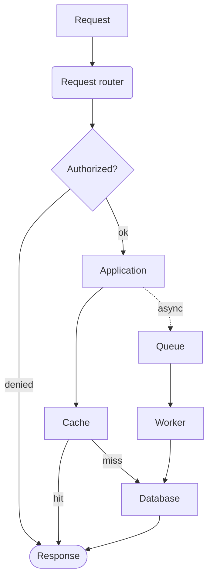

# Convert A Mermaid Flowchart

Use the CLI or the website's Mermaid workbench to turn a supported flowchart
into an editable `.isostate.yaml` starting scene. Both preserve node names,
branch labels, connection directions, and ordinary/dotted/thick links. The CLI
validates before writing; the workbench converts locally and can open its exact
result in the editor for validation and visual refinement.

The converter is authoring tooling. Your deployed scene still uses only the
small playback engine and a compiled bundle. No Mermaid parser or converter is
added to the scene runtime.

## Website Workflow

1. Open **Mermaid** in the website navigation.
2. Paste a `flowchart` or `graph`, upload a `.mmd` file, or choose an example.
3. Convert and review line-specific errors or cycle warnings.
4. Copy or download the resulting YAML, or choose **Open in editor**.
5. Validate and refine the scene: replace primitives with catalog artwork,
   give labels clear space, review routes, and add cumulative story scenes.

Editor handoff uses this browser tab's session storage; it does not upload your
source. If browser storage is unavailable, download YAML and import it in the
editor. Unsupported source features produce an error rather than a partial
conversion with hidden omissions.

## CLI Workflow

```bash
npx --package @sebastianwessel/isostate-cli isostate mermaid2dsl flow.mmd
npx --package @sebastianwessel/isostate-cli isostate mermaid2dsl flow.mmd --out scenes/flow.isostate.yaml
npx --package @sebastianwessel/isostate-cli isostate validate scenes/flow.isostate.yaml
npx --package @sebastianwessel/isostate-cli isostate compile scenes/flow.isostate.yaml --out public/flow.isostate.js
```

Without `--out`, conversion replaces the input extension with `.isostate.yaml`.
Node and label IDs are normalized and checked for collisions. Repeated edges
receive distinct deterministic connection IDs.

## Supported Input

| Mermaid syntax | Starting scene |
|---|---|
| `graph` / `flowchart` with `TD`, `TB`, `LR`, `RL`, `BT` | Reading direction with nonnegative grid cells |
| `A`, `A[text]` | Rectangle with visible text or original ID |
| `A(text)`, `A([text])` | Rounded rectangle / stadium (sampled polygons) |
| `A((text))`, `A{text}`, `A{{text}}` | Circle / diamond / hexagon |
| `A[/text/]`, `A[\text\]` | Parallelograms |
| `A[/text\]`, `A[\text/]` | Trapezoids |
| `-->`, `---` | Directed / undirected ordinary links |
| `-.->`, `-.-` | Directed / undirected dotted links |
| `==>`, `===` | Directed / undirected thick links |
| `A -->|yes| B`, `A -- yes --> B` | Connection plus separate visible branch text |
| `A -. async .-> B`, `A == main ==> B` | Labeled dotted / thick links |
| `A --> B --> C` | Pairwise connections |
| `A & B --> C & D` | All four source-to-target connections |

Statements may use newlines or semicolons. `%%` comments are ignored outside
labels. Double-quote labels containing delimiters: `A["Read [config]; continue"]`.
Quoted syntax characters remain text; escaped quotes/backslashes are preserved.

Subgraphs, styling/click/configuration directives, local `direction`, cylinder
(`[(...)]`), subroutine (`[[...]]`), flag and other unsupported shapes,
Markdown/HTML/entity labels, other arrowheads, and sequence/state/class/ER
syntax are rejected. Use the AI authoring skill for a faithful richer story;
do not delete meaningful source features merely to satisfy the parser. The
exhaustive contract lives in `specs/02-capabilities/dsl/mermaid2dsl.md`.

## Worked Example


```mermaid
flowchart TD
  Request[Request] --> Router(Request router)
  Router --> Auth{Authorized?}
  Auth -- ok --> App[Application]
  Auth -- denied --> Response([Response])
  App --> Cache[Cache]
  Cache -- hit --> Response
  Cache -- miss --> DB[Database]
  DB --> Response
  App -. async .-> Queue[Queue]
  Queue --> Worker[Worker]
  Worker --> DB
```

The complete runnable source and generated files are in
`examples/mermaid/`. The output contains nine nodes, eleven connections,
visible node captions, and five additional branch captions: `ok`, `denied`,
`hit`, `miss`, and `async`. The asynchronous connection stays dotted.

For example, the async connection retains its actual endpoints:

```yaml
- id: app-to-queue
  from:
    element: app
  to:
    element: queue
  layer: ground
  end: arrow
  style:
    pattern: dotted
```

Its label is a separate generated `text` element, not a new logical edge or a
custom DSL field. This lets you move the label while retaining the connection.

## Layout And Warnings

The starting layout uses longest-path layers with four-cell spacing and source
appearance order within each layer. `LR`/`RL` transpose the layout axis;
`RL`/`BT` mirror the layer order. All coordinates remain whole and nonnegative.

Cycle-closing edges emit `MERMAID_CYCLE_BROKEN` because only their contribution
to layout layering is ignored. Their rendered connections stay in the YAML.
Branch labels are retained; `MERMAID_LABEL_DROPPED` is no longer emitted.

The layout is a starting point. Automatic label placement cannot guarantee
clear text at every font size or an unambiguous route in dense graphs. Review
all branches in the editor, adjust whole-cell placement, wrap long labels, and
verify every perceived arrow source and target against the original Mermaid.

## From Draft To Visual Story

Keep the `.mmd` source alongside the YAML. For a polished story, install both
skills:

```bash
npx skills add sebastianwessel/isostate --skill authoring-isostate-scenes
npx skills add sebastianwessel/isostate --skill converting-mermaid-to-isostate-stories
```

Inventory every node, edge, direction, label, and branch before adding story
beats. Choose recognizable assets in one visual style, keep their checked
anchors at native one-cell size, reserve separate caption bands, and introduce
labels before actions depend on them. Use cumulative scene deltas, retain
completed context, and review each stop on desktop and mobile.

Next: [Assets Workflow](./assets-workflow.md),
[Animation And Connections](./animation-and-connections.md), and
[Deploy A Static Bundle](./deploy-static-bundle.md).
