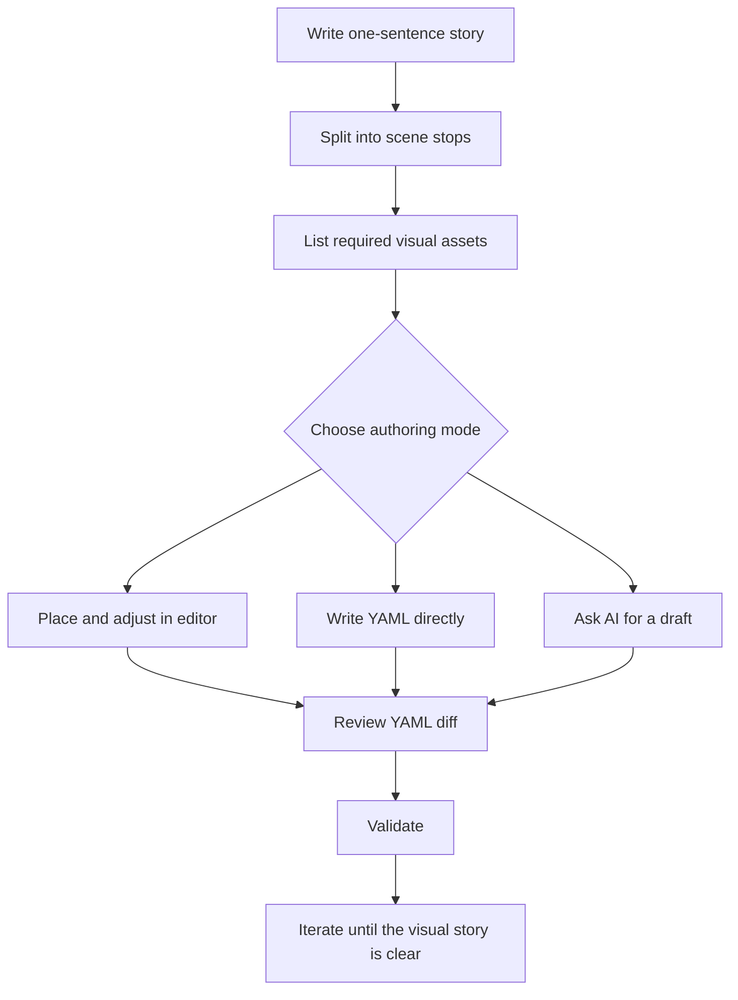

# Plan A Scene

Plan the story before writing YAML. A good isostate scene is not a pile of
objects; it is a sequence where each stop explains one thing.

## The Storyboard

Use this structure for every new scene:

| Scene Stop | Reader Should Learn | Visual Change | Verification |
|---|---|---|---|
| `initial` | What space are we looking at? | Floor, labels, first stable objects | First scene has full `elements` snapshot |
| `context` | What else matters? | Add supporting assets or zones | New ids appear under `add` |
| `relationship` | What connects to what? | Add connections, routes, roads, or arrows | Connections use `from`/`to` or whole-cell `route` |
| `change` | What moves or changes? | Update positions, styles, camera, or ambient state | Only changed fields appear under `update` |
| `finish` | What is the final takeaway? | Remove obsolete objects, settle camera, show label | Endpoint connections are removed explicitly |



## Decide What Belongs In The Scene

Keep each object useful. Add an element only when it helps the reader understand
the current step or a later transition.

Use:

- external assets for recognizable things
- `asset: text` for labels
- primitive assets for zones and underlays
- connections for roads, arrows, and flow
- camera metadata when attention should narrow or reset

Avoid:

- decorative objects that never participate in the story
- one giant SVG containing many independent objects
- long arrow SVG assets instead of first-class connections
- scene stops that change too many unrelated things at once

## Choose The Authoring Mode

| Mode | Start With | Review |
|---|---|---|
| Editor | a minimal YAML document and asset manifests | exported YAML and visual placement |
| Manual YAML | the storyboard table | validation diagnostics and rendered page |
| AI-assisted | the storyboard plus asset catalog rules | every id, layer, route, and anchor |

The authoring mode is not part of the runtime contract. The YAML is the source
of truth.

## Convert The Plan To YAML

First scene:

```yaml
scenes:
  - id: initial
    elements:
      - id: api
        asset: api-server
        at: [2, 2]
```

Later scene:

```yaml
  - id: relationship
    add:
      connections:
        - id: api-to-db
          from:
            element: api
          to:
            element: database
          end: arrow
```

Keep scene ids stable and descriptive. The order of `scenes` is the timeline;
do not author progress values.

## Verify With The Diagnostics Overlay

While iterating on a scene in the browser, attach the diagnostics overlay to
check grid alignment, element anchors, and connector routing without leaving
the page:

```ts
import { attachDiagnosticsOverlay, mountScene } from '@sebastianwessel/isostate';

const mounted = mountScene(target, sceneBundle, {
	controller: { container: document.documentElement }
});
const overlay = attachDiagnosticsOverlay(mounted, { coordinates: true });

// Later, once the scene looks right:
overlay.destroy();
```

The overlay draws floor grid lines, element anchor points, connector route
points, and a `scene <id> · progress <p>` readout, re-rendering itself on
scroll/camera changes when a controller is attached. It is a development-time
aid only: it is never included in exported snapshots or the standalone
runtime bundle. See [Diagnostics Overlay](../reference/public-api.md#diagnostics-overlay).

Next:

- [Assets Workflow](./assets-workflow.md)
- [Animation And Connections](./animation-and-connections.md)
- [Use The CLI](./use-the-cli.md)
