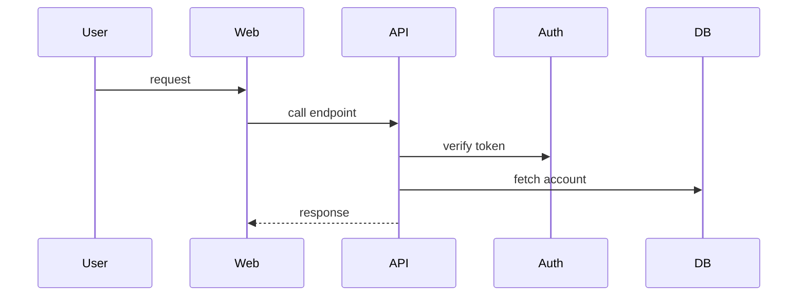
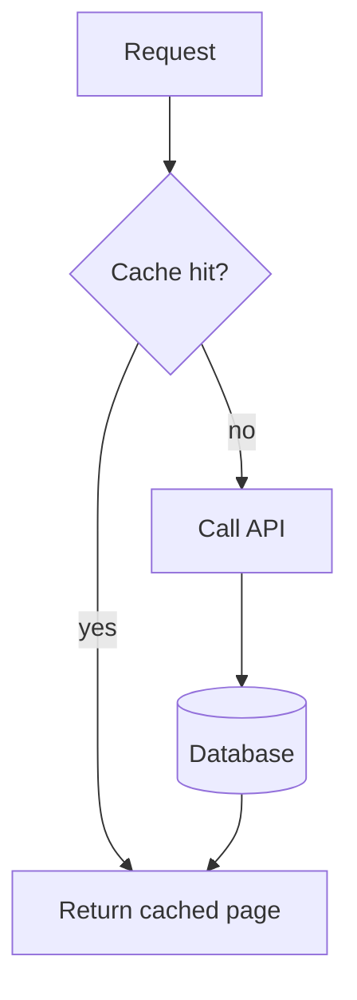
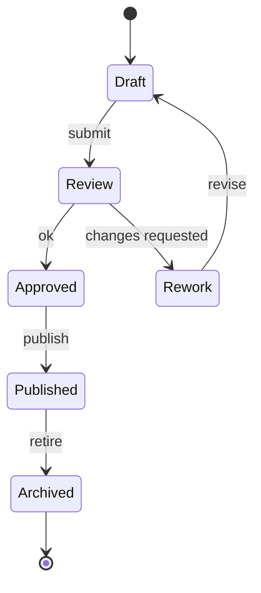

# Examples

Use these as patterns, not fixed templates.

## Sequence Diagram Storyboard

Input:



Storyboard:

| Scene | Purpose | Visual change | Active flow |
|---|---|---|---|
| `initial` | Establish the external initiator | Add User with label and camera focus | none |
| `request-enters` | Show the request reaching the web tier | Add Web with label, then User -> Web route | User -> Web |
| `api-call` | Show responsibility moving inward | Add API with label, mute User -> Web, activate Web -> API | Web -> API |
| `auth-check` | Show verification as a gated branch-capable step | Add Auth with label, activate API -> Auth, optionally add a small check marker near Auth only if it clarifies success | API -> Auth |
| `data-fetch` | Show data dependency after auth is understood | Add DB with label, mute auth route, activate API -> DB | API -> DB |
| `response` | Show completion and final route | Add API -> Web return route, mute data route, reset camera for overview | API -> Web |

If the sequence uses `alt`, `else`, `opt`, `par`, or labeled messages such as
`ok`, `denied`, `hit`, or `miss`, apply the same branch-lane and marker rules
from `story-mapping.md` that flowcharts use. Do not leave those semantics as
plain floating text.

## Flowchart Storyboard

Input:



Storyboard:

| Scene | Purpose | Visual change | Active flow |
|---|---|---|---|
| `initial` | Establish external entry | Add Request with label near an entrance edge | none |
| `cache-check` | Introduce the decision before using it | Add Cache with label, then activate Request -> Cache | Request -> Cache |
| `cache-hit` | Show one branch as its own story beat | Add Return with label near an exit edge, activate Cache -- yes --> Return with route label near Return and optional success marker if helpful | Cache -> Return |
| `cache-miss` | Show the alternate branch in a distinct lane | Add API with label, mute hit route, activate Cache -- no --> API with label near API | Cache -> API |
| `data-fetch` | Show fallback dependency | Add DB with label, activate API -> DB | API -> DB |
| `complete` | Show final outcome and reconstructable graph | Add DB -> Return, keep hit/miss branches visible but de-emphasized, reset camera | DB -> Return |

Do not add validation, error, or removal scenes unless the Mermaid source
contains them or the storyboard explicitly marks them as teaching aids. Branches
that remain part of the source should normally remain visible in the final
overview with quieter styling.

## State Diagram Storyboard

Input:



Storyboard:

| Scene | Purpose | Visual change | Active flow |
|---|---|---|---|
| `start-draft` | Establish lifecycle entry | Add start marker and Draft, activate start -> Draft | start -> Draft |
| `submit-review` | Show first event transition | Add Review, add `submit` label near Review side, activate Draft -> Review | Draft -> Review |
| `review-branches` | Show decision outcomes as state-machine alternatives | Add Approved and Rework, activate `ok` branch, keep `changes requested` as visible alternate lane | Review -> Approved |
| `rework-loop` | Show recovery path | Activate Rework -> Draft with `revise` semantics, mute approved branch | Rework -> Draft |
| `publish` | Continue happy lifecycle | Add Published and `publish` label, activate Approved -> Published | Approved -> Published |
| `terminal` | Show lifecycle exit | Add Archived and end marker, activate Published -> Archived -> end | Archived -> end |
| `overview` | Show reconstructable state machine | Keep alternate/retry paths visible but subdued, reset camera | none |

For state diagrams, labels such as `submit`, `ok`, `changes requested`,
`revise`, and `publish` are transition data. Preserve them as route-adjacent
labels or record an explicit omission reason.

## Connection Style Snippet

```yaml
connections:
  - id: api-to-db
    from:
      element: api
    to:
      element: database
    style:
      pattern: dotted
      stroke: "var(--iso-flow-active)"
      strokeWidth: 3
    end: arrow
    ambient:
      - name: flow
```

Completed version:

```yaml
update:
  connections:
    - id: api-to-db
      style:
        pattern: solid
        stroke: "var(--iso-flow-muted)"
        strokeWidth: 2
```
